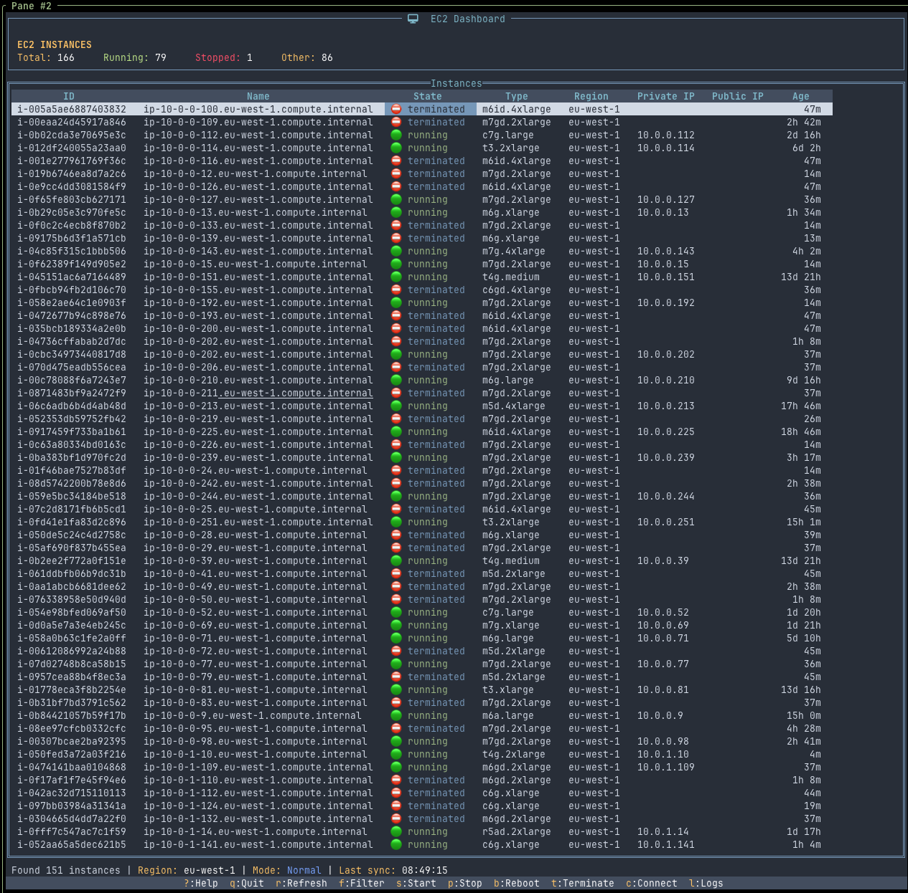

# e2c - AWS EC2 Terminal UI Manager

[](https://github.com/nlamirault/e2c/releases)
[](https://github.com/nlamirault/e2c/blob/main/LICENSE)
[](https://scorecard.dev/viewer/?uri=github.com/nlamirault/e2c)
[](https://bestpractices.coreinfrastructure.org/projects/10710)

`e2c` is a terminal-based UI application for managing AWS EC2 instances, inspired by [k9s](https://github.com/derailed/k9s) for Kubernetes and [e1s](https://github.com/keidarcy/e1s/) for ECS.



## Features

- 🖥️ Terminal-based UI for managing EC2 instances
- 🔄 View instance details, status, and resource utilization
- ⚡ Start, stop, reboot, and terminate instances
- 🔍 Filter and search for instances across multiple regions
- 🌍 Monitor resource metrics
- 🔐 Support for multiple AWS profiles and regions
- 🚩 Feature flag support via OpenFeature standard

## Installation

### Using Go

```bash
go install github.com/nlamirault/e2c/cmd/e2c@latest
```

### Binary Release

Download the latest binary from the [releases page](https://github.com/nlamirault/e2c/releases).

## Usage

```bash
# Start e2c with default profile
e2c

# Start with a specific AWS region
e2c --region eu-west-1

# Use environment variables for feature flags
e2c --openfeature-provider=env

# Show help
e2c --help
```

## Keyboard Shortcuts

| Key   | Action                               |
| ----- | ------------------------------------ |
| `?`   | Help                                 |
| `q`   | Quit                                 |
| `Esc` | Back/Close Dialog                    |
| `f`   | Filter instances                     |
| `r`   | Refresh                              |
| `s`   | Start selected instance              |
| `p`   | Stop selected instance               |
| `b`   | Reboot selected instance             |
| `t`   | Terminate selected instance          |
| `c`   | Connect to selected instance via SSH |
| `l`   | View instance logs                   |
| `/`   | Search                               |

## Configuration

e2c uses the AWS SDK's default credential chain, supporting:

- Environment variables
- AWS credentials file
- IAM roles for EC2/ECS

Configuration file located at `~/.config/e2c/config.yaml`:

```yaml
aws:
  default_region: eu-west-1
  refresh_interval: 30s

ui:
  # Compact mode reduces whitespace in the UI
  compact: false

feature_flags:
  enabled: true
  provider: env  # "configcat" or "env"
  env:
    prefix: "E2C_FEATURE_"
```

See [Feature Flags documentation](docs/feature-flags.md) for more details on available providers and configuration options.

### Environment Variables

The following environment variables can be used to configure e2c:

- `E2C_LOG_LEVEL`: Set the logging level (debug, info, warn, error)
- `E2C_LOG_FORMAT`: Set the log format ("json" or "text"). Default is text format with colors
- `E2C_FEATURE_*`: Feature flags when using the environment variables provider (prefix can be configured)

Examples:

```bash
# Set environment variables before running e2c
E2C_LOG_FORMAT=json E2C_LOG_LEVEL=debug e2c
```

Note: Command line flags take precedence over environment variables.

## Requirements

- AWS credentials configured
- Appropriate IAM permissions to list and manage EC2 instances

## SLSA

All _artifacts_ provided by this repository meet [SLSA L3](https://slsa.dev/spec/v1.0/levels#build-l3)

### Verify SLSA provenance

Using the [Github CLI]():

```shell
$ gh attestation verify --owner nlamirault e2c_darwin_arm64_v0.1.2
Loaded digest sha256:da91348beede82d764792e7166e03e3dfe29eb935b5bcb7c6dca337877fac5c8 for file://e2c_darwin_arm64_v0.1.2
Loaded 1 attestation from GitHub API
✓ Verification succeeded!

sha256:da91348beede82d764792e7166e03e3dfe29eb935b5bcb7c6dca337877fac5c8 was attested by:
REPO            PREDICATE_TYPE                  WORKFLOW
nlamirault/e2c  https://slsa.dev/provenance/v1  .github/workflows/release.yml@refs/tags/v0.1.2
```

## SBOM

You could use [trivy](https://trivy.dev) to read SBOM file:

```shell
$ trivy sbom ~/Downloads/e2c.exe_0.1.3_windows_arm64.sbom.json
2025-06-06T17:39:52+02:00       INFO    [vuln] Vulnerability scanning is enabled
2025-06-06T17:39:52+02:00       INFO    Detected SBOM format    format="spdx-json"
2025-06-06T17:39:52+02:00       INFO    Number of language-specific files       num=1
2025-06-06T17:39:52+02:00       INFO    [gobinary] Detecting vulnerabilities...
2025-06-06T17:39:52+02:00       WARN    Using severities from other vendors for some vulnerabilities. Read https://aquasecurity.github.io/trivy/v0.55/docs/scanner/vulnerability#severity-selection for details.

 (gobinary)

Total: 1 (UNKNOWN: 0, LOW: 0, MEDIUM: 1, HIGH: 0, CRITICAL: 0)

┌─────────┬────────────────┬──────────┬────────┬───────────────────┬────────────────┬──────────────────────────────────────────────────────────┐
│ Library │ Vulnerability  │ Severity │ Status │ Installed Version │ Fixed Version  │                          Title                           │
├─────────┼────────────────┼──────────┼────────┼───────────────────┼────────────────┼──────────────────────────────────────────────────────────┤
│ stdlib  │ CVE-2025-22871 │ MEDIUM   │ fixed  │ 1.22.12           │ 1.23.8, 1.24.2 │ net/http: Request smuggling due to acceptance of invalid │
│         │                │          │        │                   │                │ chunked data in net/http...                              │
│         │                │          │        │                   │                │ https://avd.aquasec.com/nvd/cve-2025-22871               │
└─────────┴────────────────┴──────────┴────────┴───────────────────┴────────────────┴──────────────────────────────────────────────────────────┘
```

or with [grype](https://github.com/anchore/grype):

```shell
$ cat ./e2c.exe_0.1.3_windows_arm64.sbom.json | grype
NAME    INSTALLED  FIXED-IN        TYPE       VULNERABILITY   SEVERITY
stdlib  go1.22.12  1.23.8, 1.24.2  go-module  CVE-2025-22871  Critical
```

## Contributing

Contributions are welcome! Please feel free to submit a Pull Request.

## License

Apache Version 2.0
